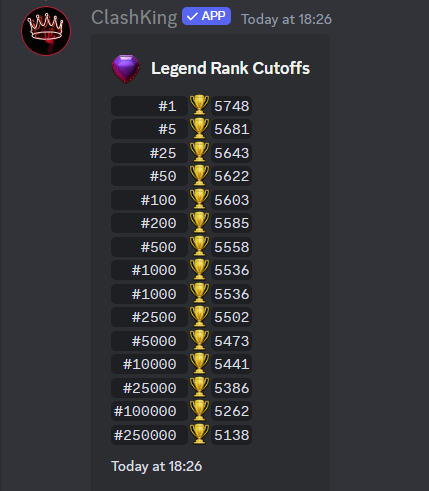

# Developer Portal

To get started with creating a discord bot you will have to create the underlying bot. Kinda like you create a discord account and that is your profile, you are making a bot profile.\
\
So to get started we will have to go to the discord developer portal. [This link](https://discord.com/developers/applications?new\_application=true) will take you there.\
\
After you sign in, you should see something like the below.

<figure><figcaption>
Create an Apllication Prompt
</figcaption></figure>

Fill it in with a name, it can be whatever you plan to name your bot. Agree with the terms of service and press create. Now you will see something like the below.\
\

<figure><figcaption>
Initial Application Screen
</figcaption></figure>

Go to the bot section (highlighted). To start you will fill in the name and change the profile picture to your liking then Save Changes. Once done, click Reset Token, confirm, and save that token somewhere safe (you will need it later)

<figure><figcaption>
Bot Naming, Profile Picture, and Token Generation Screen
</figcaption></figure>

Now staying on the page, you will need to scroll down to the Privileged Gateway Intents section. You will need to flip Server Members Intent and Message Content Intent to ON. This is critical or the bot will NOT start! While you are there, just above these switches is a Public Bot switch, I recommend flipping to OFF so that others can't add your bot. (All pictured & highlighted below)\

<figure><figcaption>
Option Switches
</figcaption></figure>

Now you have your bot named & with a profile picture, your token, and the needed options flipped. Lastly you will need to make an invite link so that your bot can be invited to your server! If you look on the side-panel, you will see an option called Oath2, when clicked it will expand and click URL generator.

<figure><figcaption>
URL generator
</figcaption></figure>

In here you will click what it is you are creating in the top section (bot). And then what perms in the bottom section (will appear after clicking "bot"). For most uses, I recommend Admin, just as I do for the main clashking bot, but even more so here. If you invite with lesser perms, and it is unable to send logs and stuff, things may break, so at the very least invite with admin, then whittle down the perms afterwards. \

<figure><figcaption>
Click Bot &#x26; Admin
</figcaption></figure>

Now with those options selected. At the bottom, you will see a url and a copy button. Copy that URL and save it along with that token from earlier and move on to[ Start Up](start-up.md) (next guide section)

<figure><figcaption>
Copy your invite link
</figcaption></figure>
